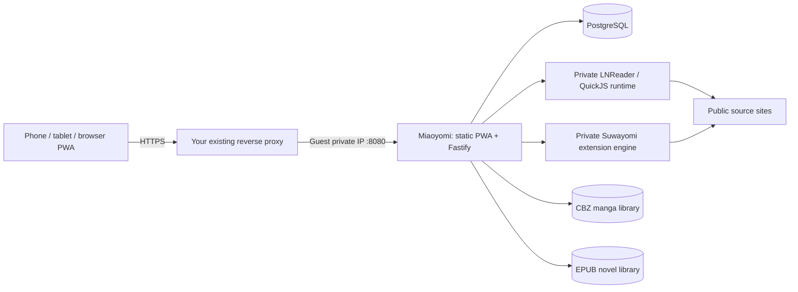

# Deploy Miaoyomi in your Proxmox LXC

Run one Docker Compose stack in one **x86_64 LXC guest** on your three-node cluster. Your existing reverse proxy terminates HTTPS and forwards to the guest. Fastify remains the API server; Uchiyomi accounts remain enabled.



## Guest and storage

Use an unprivileged Debian/Ubuntu LXC with Docker Engine, the Compose plugin, Git and Python 3. Start with **4 vCPU and 6 GiB RAM**, with additional space for books. This is a starting allocation, not a measured capacity guarantee. Building Next.js also needs memory; the optional solver can use another 2 GiB.

Enable nesting and keyctl in the guest's Proxmox **Options → Features**. Preserve any features already set. The [official LXC configuration source](https://github.com/proxmox/pve-container/blob/master/src/PVE/LXC/Config.pm) documents both flags and identifies keyctl as required for Docker in an unprivileged container. Install Docker using its [Debian instructions](https://docs.docker.com/engine/install/debian/). Keep the normal unprivileged guest and Docker security defaults.

Choose persistent storage mounted **inside the guest**. All configured paths are guest paths, not paths on the Proxmox host. Match `PUID` and `PGID` to their owner as seen inside the guest; account for your LXC ID mapping when presenting a host dataset. Keep PostgreSQL on storage with reliable POSIX file locking/fsync. The app may write the two download directories. Existing manga is mounted read-only by default.

| Path / volume | Durable contents | Backup needed |
| --- | --- | --- |
| `MANGA_LIBRARY_PATH` → `/library` | Existing manga archives | Yes |
| `MANGA_DOWNLOAD_PATH` → `/library-dl` | Source-generated CBZ | Yes |
| `NOVEL_LIBRARY_PATH` → `/novels` | Source-generated EPUB; one archive per novel | Yes |
| `database` | Accounts, metadata, chapter lists, reading progress | Yes |
| `app_config` | Settings, source configuration, artwork | Yes |
| `novel_engine` | Approved plugin digests and enabled sources | Yes |
| `suwayomi` | Extension installation and configuration | Yes |
| `app_cache`, `app_backups` | Regenerable image cache; convenience DB/config dumps | Full backup covers original data separately |

Keep the novel directory outside the manga scanner. Chapter prose and embedded illustrations are stored inside EPUBs; temporary plugin responses are held in memory. Device downloads use account-scoped IndexedDB and are independent of these server files.

## Start

Place this checkout in the guest (for example `/opt/miaoyomi`). The local downstream is based on Uchiyomi commit `7407f4dab416724c65839b0e2e6a9f8ddfe45e55`. It must build from this checkout: the upstream image does not include the new novel implementation.

```sh
cd /opt/miaoyomi
bash scripts/miaoyomi-setup.sh --config-only
```

Edit `.env` with your guest's real private address, HTTPS hostname and library paths:

```dotenv
BIND_ADDRESS=10.0.0.25
WEB_PORT=8080
PUBLIC_ORIGIN=https://read.example.com
PUID=10002
PGID=10002
MANGA_LIBRARY_PATH=/srv/miaoyomi/manga
MANGA_DOWNLOAD_PATH=/srv/miaoyomi/downloaded-manga
NOVEL_LIBRARY_PATH=/srv/miaoyomi/novels
```

The addresses above are examples. The helper generates private secrets, preserves populated values and creates missing library directories. When invoked as root, it assigns ownership only to directories it creates. Give existing writable download directories the selected guest UID/GID before startup; it does not take ownership of an existing read-only collection. Do not change the generated PostgreSQL password after initialisation without also changing it in PostgreSQL.

```sh
bash scripts/miaoyomi-setup.sh
docker compose -f compose.yaml ps
```

Use **`-f compose.yaml`** in all commands in this guide. The original upstream development Compose file is retained separately. The app and novel-engine builds explicitly target `linux/amd64`; other pinned service images select the host architecture. Default binding is `127.0.0.1`; a proxy outside this guest needs its reachable private address as above. PostgreSQL and both source engines publish no host ports. Docker's [port binding and health dependency semantics](https://docs.docker.com/reference/compose-file/services/) are used directly.

Open the HTTPS hostname and create the first administrator through the existing setup screen. Under Novels, enable the sources you want, browse or search, open a title and select a chapter. This fetches that chapter and places it in a standard EPUB. Use **Download for offline** for a copy on that device. Manga source results likewise offer chapter selection and immediate reading through a CBZ; adding an entire series remains optional.

## Existing reverse proxy

Forward the entire origin to `http://GUEST_PRIVATE_IP:8080`, including `/api/`, `/sw.js`, `/manifest.webmanifest` and Next static assets. Preserve the public `Host`; set trusted `X-Forwarded-Proto: https` and the client forwarding header. The app currently inherits Uchiyomi's `trustProxy: true`; restrict guest port 8080 to the trusted proxy/LAN with your existing firewall.

Allow about **180 seconds** for an on-demand source request. Forward cookies and authorization headers. Do not cache authenticated API responses or strip their private/no-store headers. Serve the PWA under its own origin at `/`, rather than a path prefix. HTTPS is needed for service workers on phones; plain HTTP works for localhost development only. No additional proxy container is needed in this stack.

## Sources and updates

Manga retains Uchiyomi's built-in/generic source support and Suwayomi's Mihon-compatible extensions. Install extension repositories/sources through the existing admin controls. The optional `solver` profile serves upstream manga engines that support it:

```dotenv
FLARESOLVERR_URL=http://solver:8191
```

```sh
docker compose -f compose.yaml --profile solver up -d
```

The novel engine does not send source plugins to a browser or give them Node.js access. It runs pinned LNReader scripts inside QuickJS with guarded networking. All sources start disabled. The registry includes 278 published scripts; 249 pass static/runtime metadata compatibility checks. This count does **not** mean all sites are reachable. Royal Road and public guest-readable AO3 works were live-tested. Challenges, consent pages and unsupported capabilities return explicit errors. See [runtime compatibility, provenance and updating](../novel-engine/README.md).

Updates are deliberate: review upstream changes, run the suites, make a full backup, rebuild and restart. Preserve the LNReader vendor licenses and approved digests. Source configuration is a shared admin choice; private source login sessions are not implemented.

## Cluster operation

The three Proxmox nodes provide a place to run/migrate this guest. This Compose file runs one application instance and one PostgreSQL instance. If you enable Proxmox HA, make **all** guest volumes and bind mounts available on the destination node through your existing storage/replication arrangement. Avoid launching independent active copies against the same library. A guest backup may exclude host bind mounts: verify their coverage explicitly.

See [full backup and restoration](backup-restore.md). Local development verification and any environment limitations are recorded in [verification](verification.md).
