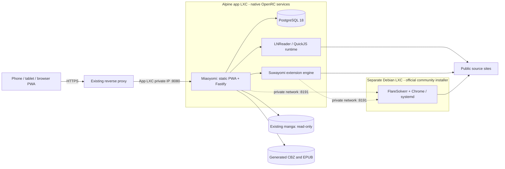

# Native Miaoyomi installation on Proxmox

Run the installer **as root on a Proxmox VE 8/9 node**. It creates an unprivileged **x86_64 Alpine 3.24 LXC** with PostgreSQL 18, Node 24, OpenJDK 25, Suwayomi and Miaoyomi under OpenRC. By default it also launches the [official community FlareSolverr wizard](https://community-scripts.org/scripts/flaresolverr), which creates a separate Debian LXC with native FlareSolverr, Chrome and systemd. The installer connects the two guests. Your existing reverse proxy supplies HTTPS. The node and guests need internet access for templates, packages and dependencies.

No Docker, Podman or other container runtime is installed inside either LXC. The app's optional `--nesting yes|no` setting controls a Proxmox feature and defaults to `no`; enabling it is compatible with this native deployment. The solver keeps the official installer's feature settings, including its default nesting support. See the [community backend](https://raw.githubusercontent.com/community-scripts/core/main/pve/backend.func) and [Proxmox LXC feature reference](https://pve.proxmox.com/pve-docs/pct.conf.5.html).

This path creates **new native installations**. It does not convert an existing Compose deployment or import its database/volumes. The existing [Compose option](#compose-alternative) remains available.



## One-command installation

Run this command as root in an interactive **Proxmox node shell**:

```sh
bash -c "$(curl -fsSL https://raw.githubusercontent.com/samitaaissat/Miaoyomi/main/scripts/proxmox/create-lxc.sh)"
```

The published installer defaults to `https://github.com/samitaaissat/Miaoyomi.git` and `main`, fetches its own source, and saves that repository/ref for `miaoyomi update`. No tag, GitHub release or GHCR image is needed. Keep the terminal open while the two interactive wizards and installation run. Have your storage/network settings and public HTTPS hostname ready.

The wizard asks for the app container ID, hostname, CPU/RAM/disk, root and template storage, bridge, DHCP or static IPv4, optional VLAN, public HTTPS origin, app port, optional existing manga directory and solver choice. It shows the chosen settings before creating the app container. App defaults are **4 cores, 6144 MiB RAM and 32 GiB disk**, independent of the solver. Add space for generated books and update backups. These are starting allocations, not measured capacity guarantees.

By default, **FlareSolverr is enabled** and its official interactive wizard creates another LXC. That wizard controls the solver's resources, storage and network; its current defaults are Debian 13, 2 cores, 2048 MiB RAM and 4 GiB disk. Choose networking reachable from the app guest. The wrapper identifies the new solver, discovers its address and checks it from the app guest before configuring Miaoyomi and Suwayomi. [Official FlareSolverr CT script](https://raw.githubusercontent.com/community-scripts/ProxmoxVE/main/ct/flaresolverr.sh).

Keep the prefilled host post-install hook in the official wizard: it reports the actual new CT ID, even if you change the ID in the wizard. If that receipt is missing or invalid, the wrapper stops without guessing a container. Inspect `pct list` and reuse the intended solver explicitly on a subsequent install.

If you prefer to install an unpublished local checkout, copy it to `/root/Miaoyomi` on the node and run `bash /root/Miaoyomi/scripts/proxmox/create-lxc.sh --source-dir /root/Miaoyomi`. It must contain this downstream's `bff/`, `web/`, `novel-engine/` and installer files. Local source transfer includes uncommitted changes and excludes `.env`/`.env.*`, `.npmrc`, dependency/build directories, caches and VCS metadata. Installation generates new secrets in the guest. Existing libraries are attached separately; they are not installation sources.

You can review a configured operation with `--dry-run`; it validates inputs and prints the creation command without checking live host availability or fetching remote sources. `--yes` accepts the app configuration for unattended creation, but **cannot automate the official FlareSolverr wizard**. Combine it with an existing solver ID/URL or `--flaresolverr no`; `--yes` with a new solver is rejected. For example, with your own addresses and storage names:

```sh
bash /root/Miaoyomi/scripts/proxmox/create-lxc.sh \
  --source-dir /root/Miaoyomi \
  --ctid 120 --hostname miaoyomi \
  --cores 4 --memory 6144 --disk 32 \
  --storage local-lvm --template-storage local \
  --bridge vmbr0 --ip 10.0.0.25/24 --gateway 10.0.0.1 \
  --public-origin https://read.example.com --web-port 8080 \
  --flaresolverr no \
  --dry-run
```

Replace `--dry-run` with `--yes` to create that configured guest. Use `--ip dhcp` without a gateway for DHCP, `--vlan 20` for a tagged network, and `--manga-mount /srv/books/manga` to expose an existing directory on the node read-only at `/mnt/manga` inside the guest. Keep DHCP leases stable if your proxy targets an IP address.

Select a solver mode; an existing CT ID and URL cannot be supplied together:

| Option | Behavior |
| --- | --- |
| `--flaresolverr yes` | Default: run the official interactive wizard for a separate Debian LXC |
| `--flaresolverr no` | Disable the solver connection |
| `--flaresolverr-ctid 121` | Reuse an existing local LXC with the native community FlareSolverr service |
| `--flaresolverr-url http://10.0.0.26:8191` | Connect to an existing reachable endpoint, including one on another node |

For example, reuse a local native solver without increasing the app's resource allocation:

```sh
bash /root/Miaoyomi/scripts/proxmox/create-lxc.sh \
  --source-dir /root/Miaoyomi --public-origin https://read.example.com \
  --flaresolverr-ctid 121 --yes
```

The installer rejects an existing app container ID. If app setup fails after creation, it preserves that guest for diagnosis; it does not destroy the app guest or overwrite another installation. The official solver wizard retains its own installation and failure handling. Enter the app with `pct enter CTID` and inspect `/var/log/miaoyomi/install.log` if guest installation began. The app installer does not set a root login password or SSH access. Inspect both guests and the reported failed step before retrying; reuse a successfully created solver with `--flaresolverr-ctid ID`.

If an older installer fails during template extraction with `tar: /var/lib/lxc/CTID/rootfs: Cannot open: Permission denied`, download the current script and retry the same settings. The host installer now gives Proxmox a `022` umask so its mapped extraction user can traverse newly created directories. When Proxmox has removed the failed guest's disks and configuration, the retry removes only its empty, root-owned, unmounted CT directory and optional empty `rootfs` directory. It confirms the ID is unused and refuses symlinks or any remaining files; inspect any refusal before retrying. Configuration files and solver receipts remain private.

## Git source and remote one-liner

The one-command installer uses the public `samitaaissat/Miaoyomi` repository and tracks `main` by default. It builds the app, frontend and novel engine from their committed lockfiles inside Alpine. Docker image builds and release workflows do not gate this native path.

To supply options to the remote command, put `--` before them. For example, preview an installation using an existing solver:

```sh
bash -c "$(curl -fsSL https://raw.githubusercontent.com/samitaaissat/Miaoyomi/main/scripts/proxmox/create-lxc.sh)" -- --dry-run --public-origin https://read.example.com --flaresolverr-ctid 121
```

Tags are optional. For a reproducible install, select a published commit or tag in both the download URL and `--ref`. This example selects the initial native installer commit:

```sh
bash -c "$(curl -fsSL https://raw.githubusercontent.com/samitaaissat/Miaoyomi/d7d18886e917f33a882a03a03dbfd33039e29e82/scripts/proxmox/create-lxc.sh)" -- --ref d7d18886e917f33a882a03a03dbfd33039e29e82
```

`miaoyomi update` follows the saved ref: `main` gets new commits, while a commit/tag remains pinned. Use `miaoyomi update --ref main` to start following the branch, or supply a new reviewed tag/commit explicitly. A Miaoyomi ref does not pin Alpine package updates or the independently maintained community FlareSolverr installer.

For a different Miaoyomi fork, pass `--repo HTTPS_URL --ref REF`. For a repository requiring credentials, prepare a local checkout on the node and use `--source-dir`; do not put credentials in the URL. The original Uchiyomi repository lacks Miaoyomi's novel features and is not a valid source.

Git-source installation installs Git on the Proxmox node if it is missing. Alpine package setup enables the matching `community` repository when needed for npm and Java.

## Services, storage and existing collections

The application exposes its selected LAN port, normally **8080**. PostgreSQL and both source engines bind to loopback inside the guest. The app and novel engine run as distinct unprivileged users. The novel worker cannot read the application's database secrets or book directories. Native services share the guest OS; their isolation differs from the separate containers in Compose.

| Guest path | Purpose |
| --- | --- |
| `/etc/miaoyomi/app.env` | Application configuration and database credentials |
| `/etc/miaoyomi/novel.env` | Private novel-engine configuration |
| `/etc/miaoyomi/suwayomi.env` | Suwayomi launch configuration |
| `/etc/miaoyomi/suwayomi-solver.env` | Managed Suwayomi solver flags; changed through `set-solver` |
| `/etc/miaoyomi/install.conf` | Saved installation source/settings and solver connection metadata |
| `/var/lib/miaoyomi/{config,cache,novel-engine,suwayomi}` | Application and source-engine state |
| `/var/lib/miaoyomi/{manga,downloaded-manga,novels}` | Default manga collection and generated CBZ/EPUB directories |
| `/var/lib/postgresql/18/data` | PostgreSQL database files |
| `/etc/postgresql` | PostgreSQL configuration |
| `/opt/miaoyomi/releases` and `/opt/miaoyomi/current` | Versioned application builds and active release |
| `/mnt/manga` | Optional existing collection from `--manga-mount`, read-only |

The installer does not recursively change ownership of an existing collection. A bind mount must already be readable by the app's UID **as mapped through the unprivileged LXC**. Inspect `pct config CTID` and the guest account IDs before applying permissions to a host dataset; do not assume an ID from a previous Compose deployment still applies. Keep the existing library read-only and give only the app's generated-book directories write access.

Keep PostgreSQL on storage that supports reliable file locking and fsync. Keep generated EPUBs outside the manga scanner's directory. Device-offline books live in account-scoped browser storage and are independent of server files.

## Reverse proxy and first use

Forward the entire HTTPS origin to `http://GUEST_PRIVATE_IP:8080` (or your selected port), including `/api/`, `/sw.js`, `/manifest.webmanifest` and static assets. Preserve the public `Host`; set trusted `X-Forwarded-Proto: https` and client forwarding headers. Fastify inherits Uchiyomi's `trustProxy: true`, so restrict the app port to your trusted proxy/LAN using your existing firewall.

Allow about **180 seconds** for on-demand source requests. Forward cookies and authorization headers. Do not cache authenticated API responses or strip their private/no-store headers. Serve the PWA at `/` on its own origin. Phone service workers require HTTPS; localhost development is the exception.

Open the HTTPS hostname and create the first administrator through the setup screen. Under **Novels**, enable a source, browse/search, select a title and then a chapter. Fetching a chapter stores it in a standard EPUB. Manga chapter selection likewise creates a CBZ and opens it immediately. **Download for offline** saves a separate copy on that device.

## Updates and maintenance

Run these commands as root **inside the guest**, for example after `pct enter 120` on the node:

```sh
miaoyomi status
miaoyomi logs
miaoyomi logs novel
miaoyomi restart
miaoyomi backup
```

`logs` accepts `app` (the default), `novel`, `suwayomi` or `postgres`. OpenRC service names are `miaoyomi`, `miaoyomi-novel`, `miaoyomi-suwayomi` and `postgresql`.

FlareSolverr logs live in its separate Debian guest. On the Proxmox node, use `pct enter SOLVER_CTID`, then run `journalctl -u flaresolverr -f` there.

A Git-based installation remembers its source and ref:

```sh
miaoyomi update
miaoyomi update --ref YOUR_REVIEWED_REF
```

For a local installation, copy the replacement checkout **into the guest** and specify its guest path:

```sh
miaoyomi update --source-dir /root/Miaoyomi-next
```

An app update builds the new release before stopping services. Before cutover it stops writers and backs up the database, configuration, source state and generated books. It keeps the preceding release and backup if migration or readiness fails. A failed cutover leaves writers stopped and the selected release available for diagnosis. Inspect the reported failure before resuming service: switching only the code symlink back is unsafe after a database migration.

App updates preserve secrets, source settings and the external solver connection. They do not upgrade Alpine/PostgreSQL major versions, refresh the approved LNReader registry or update Suwayomi or the separate FlareSolverr guest. The initial Suwayomi release is pinned to **v2.3.2243** with a verified SHA-256. Updating it is explicit and uses the same backup discipline:

```sh
miaoyomi update-suwayomi --version v2.3.2243 \
  --sha256 821141b32e170d4a02d3cbdfed577ed8f07bd22383ff5f4132ebb5ae40e98dd5
```

This example selects the initial version. Replace both values with the stable release and matching JAR digest you reviewed in the [official release assets](https://github.com/Suwayomi/Suwayomi-Server/releases). Keep PostgreSQL at major 18 until you perform a planned database migration. Alpine 3.24 provides native Node 24 and PostgreSQL 18; Java is supplied by its `community` repository, whose support period ends at the next stable Alpine release. Plan OS maintenance separately from app updates. See [Alpine support policy](https://alpinelinux.org/releases/).

To update a native community solver and refresh the app's connection afterward, run on the **Proxmox node hosting both LXCs** (replace `120`/`121` with the actual IDs):

```sh
bash /root/Miaoyomi/scripts/proxmox/create-lxc.sh \
  --update-solver 120 --flaresolverr-ctid 121
```

This invokes the solver's official `/usr/bin/update` inside its Debian guest, rediscovers its address and calls the app's `miaoyomi set-solver` command. It verifies reachability from the app guest before updating Miaoyomi and Suwayomi settings. The official updater owns solver version checks and replacement; its current implementation stops the service and replaces `/opt/flaresolverr`. Keep a separate solver CT backup before updating. The app backup cannot restore the solver guest. [Community update entrypoint](https://raw.githubusercontent.com/community-scripts/core/main/core/core.func), [FlareSolverr update implementation](https://raw.githubusercontent.com/community-scripts/ProxmoxVE/main/ct/flaresolverr.sh).

After an address change or solver replacement, reconnect from the app's Proxmox node:

```sh
bash /root/Miaoyomi/scripts/proxmox/create-lxc.sh \
  --reconnect 120 --flaresolverr-ctid 121
# For an endpoint on another node or host:
bash /root/Miaoyomi/scripts/proxmox/create-lxc.sh \
  --reconnect 120 --flaresolverr-url http://10.0.0.26:8191
```

An existing URL can be connected directly **inside the app guest** as well:

```sh
miaoyomi set-solver --url http://10.0.0.26:8191 --ctid 121
# An empty URL disables the connection:
miaoyomi set-solver --url ''
```

`--ctid` is optional connection metadata for a local native solver; omit it for an external endpoint. `set-solver` checks a nonempty endpoint, backs up before changing managed configuration and preserves unrelated settings and secrets. It updates both the app and Suwayomi; manual edits to their configuration files are unnecessary. A recorded CT ID does not follow DHCP address changes automatically: use a stable address or rerun `--reconnect`.

## Source engines and optional FlareSolverr

Manga uses Uchiyomi's built-in/generic sources and Suwayomi's Mihon-compatible extensions. Configure extension repositories/sources through the existing admin controls.

Choose **yes** at the FlareSolverr prompt to run the official community installer for its **separate Debian LXC**. Miaoyomi does not install FlareSolverr or a browser in Alpine. The official installer installs Chrome, the FlareSolverr Linux release and a native systemd service. The wrapper discovers the resulting container and address, checks the solver from the app guest, and configures both the app's `FLARESOLVERR_URL` and Suwayomi to use `http://SOLVER_PRIVATE_IP:8191`. Existing native guests or external endpoints can be selected instead. [Official FlareSolverr installer](https://raw.githubusercontent.com/community-scripts/ProxmoxVE/main/install/flaresolverr-install.sh).

Give both guests routable private addresses, using the same bridge/VLAN or an existing route between them. Reserve the solver's DHCP lease or choose a static IP; do the same for the app if the proxy targets its IP. Permit **TCP 8191 from the app LXC to the solver LXC** in any Proxmox, guest or network firewall, and retain the solver's outbound DNS/HTTP/HTTPS access for browsing. Restrict its listener to trusted clients using your existing firewall. The installer does not publish it through the reverse proxy or change your firewall rules. If the app and solver move to different nodes, their private route must still work; use `--flaresolverr-url` from the app node when the solver is no longer local.

A successful health check confirms the service is reachable; it does not mean every site's challenge can be solved. Browser startup and live challenge handling still need real-guest acceptance checks. FlareSolverr has its own resources and service lifecycle. See its [health endpoint and listener defaults](https://raw.githubusercontent.com/FlareSolverr/FlareSolverr/master/src/flaresolverr.py).

The native Alpine service runs Suwayomi headlessly with its system tray, automatic browser opening and **KCEF WebView disabled**, including when FlareSolverr is selected. FlareSolverr's browser is separate from Suwayomi's WebView. Some extensions specifically require WebView and will not work with this configuration. See [Suwayomi's Linux requirements](https://github.com/Suwayomi/Suwayomi-Server#webview-support-gnulinux).

A solver is not a replacement for every extension's WebView requirements. Suwayomi's `server.flareSolverrEnabled` and `server.flareSolverrUrl` settings are managed by installation and `set-solver`; see [Suwayomi configuration](https://github.com/Suwayomi/Suwayomi-Server/wiki/Configuring-Suwayomi%E2%80%90Server).

The novel engine executes approved LNReader scripts in QuickJS with guarded networking. All sources start disabled. Its registry contains 278 published scripts; 249 passed metadata compatibility checks, which does not establish live site availability. Royal Road and public guest-readable AO3 works were live-tested in the application verification. Challenges, consent pages and unsupported browser capabilities return explicit errors. The optional manga solver does not give novel plugins browser access. See [runtime compatibility and source updates](../novel-engine/README.md).

## Backup, recovery and cluster operation

Run `miaoyomi backup` before maintenance and copy its reported backup directory off the guest. The default location is `/var/backups/miaoyomi/TIMESTAMP`; use `miaoyomi backup --output /PATH/TO/NEW/BACKUP` to choose another destination outside the managed state directories. Each backup contains `database.dump`, `files.tar.gz` and `manifest.txt`; an `.incomplete` marker means it did not complete. Backups contain credentials and books, so keep them private.

Updates also produce a backup before cutover. App backups include solver connection configuration and any recorded solver CT ID, but **contain no files, browser installation or service state from the separate solver guest**. Back up that guest separately through Proxmox. These native archives are separate from the Compose backup format. The `scripts/miaoyomi-backup.py restore-empty` command and [Compose restore guide](backup-restore.md) **do not restore a native installation**.

Keep a complete Proxmox backup of the guest for recovery, including application releases, `/etc/miaoyomi`, PostgreSQL configuration/data and `/var/lib/miaoyomi`. Stop the guest for an application-consistent CT backup, or use your established database-consistent backup procedure. There is no automatic native archive-restore command; retain the matching application release and PostgreSQL major with each archive for controlled recovery. Do not unpack an archive over a running installation.

Host bind mounts, including `/mnt/manga`, are not covered by the native generated-state backup or assumed to be included in a CT backup. Back up the source collection separately and verify that it can be restored. Proxmox documents the [backup limitations of bind mounts](https://pve.proxmox.com/pve-docs/chapter-pct.html#pct_mount_points).

This installation runs one active application and one PostgreSQL instance, plus the optional separate solver LXC. For migration or HA across your three nodes, make every guest volume and host/NAS bind mount available on the destination node through your existing storage/replication arrangement. Protect both CTs and retain private network reachability between them. Never launch independent active copies against the same writable book directories. After restore or migration, reconnect the solver if its address or CT ID changed. Verify login, library counts, stored CBZ/EPUB reading with source engines stopped, and recent progress before returning a restored guest to the proxy.

## Compose alternative

To retain the original container-based deployment, prepare a Linux guest with Docker Engine, the Compose plugin, Git and Python 3, then run from this checkout **inside that guest**:

```sh
bash scripts/miaoyomi-setup.sh --config-only
# Edit .env: private BIND_ADDRESS, HTTPS PUBLIC_ORIGIN, library paths, PUID/PGID.
bash scripts/miaoyomi-setup.sh
docker compose ps
```

Compose defaults to localhost port 8080; set a reachable private `BIND_ADDRESS` for an external reverse proxy. `docker-compose.yml` pulls the published app and engine images. A source checkout uses `MIAOYOMI_COMPOSE_MODE=dev` with `-f docker-compose.yml -f docker-compose.dev.yml`, which builds those two images locally. Its `.env`, Docker volumes, UID/GID settings and [backup/restore commands](backup-restore.md) belong to Compose and are not used by the native manager. Refer to [Docker's Debian installation instructions](https://docs.docker.com/engine/install/debian/) and the [Proxmox LXC feature reference](https://pve.proxmox.com/pve-docs/pct.conf.5.html) if choosing nested Docker yourself.

See [verification results and untested Proxmox acceptance checks](verification.md). No change to a real Proxmox cluster, published repository or reverse proxy is implied by the local installer checks.
